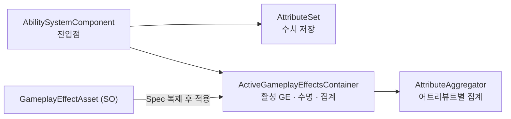

# AbilitySystem-For-Unity

Unreal Engine 5의 Gameplay Ability System(GAS)을 참고해 필요한 부분만 Unity에 다시 구현한 어빌리티 시스템이다. 라이브러리를 그대로 옮긴 게 아니라, GAS에서 필요한 개념만 골라 직접 구현했다.

> 🚧 **개발 중 (WIP)** — 완성본이 아니다. 수치 계층은 동작하고, 실행 계층(GameplayAbility)과 데모 씬은 **미완**이다. 시스템별 상태는 아래 [시스템](#시스템) 표.

## 구조

모든 수치 변경은 **GameplayEffect(GE)** 하나를 거친다.
GE는 ScriptableObject로 정의하고, 적용할 때 대상별 런타임 인스턴스(Spec)로 복제된다.



값은 두 가지로 나뉜다.

- **BaseValue** — 데미지·힐처럼 영구적으로 바뀌는 값.
- **CurrentValue** — 버프·장비처럼 활성 mod를 모아 계산하는 값. 효과가 빠지면 원래대로 돌아간다.

다른 어트리뷰트를 참조하는 값(예: 방어력 = 힘의 10%)은, 참조 대상이 바뀌면 자동으로 다시 계산된다.

## 시스템

각 시스템의 개념·구조·UE 대비는 문서에서 다룬다. 전체 인덱스는 [아키텍처 개요](dev-docs/project/architecture/ability-system/overview.md).

| 시스템 | 상태 | 요약 | 문서 |
|---|---|---|---|
| Attribute | ✅ 구현 | 타입드 `AttributeSet` + 런타임 핸들(FieldInfo 캐싱), SO 초기화 | [attribute](dev-docs/project/architecture/ability-system/attribute.md) |
| GameplayEffect | ✅ 구현 | SO 정의 / 런타임 Spec 분리, Modifier·Instant/Duration/Infinite·주기 실행·Execution | [gameplay-effect](dev-docs/project/architecture/ability-system/gameplay-effect.md) |
| Aggregator | ✅ 구현 | 어트리뷰트별 CurrentValue 집계 + 캡처 대상 변경 시 라이브 재평가 | [aggregator](dev-docs/project/architecture/ability-system/aggregator.md) |
| Capture | ✅ 구현 | Source/Target·snapshot 어트리뷰트 캡처 (AttributeBased·Execution이 소비) | [capture](dev-docs/project/architecture/ability-system/capture.md) |
| GameplayAbility | 📋 계획 | 수치 계층 위에 올리는 실행 계층 | [gameplay-ability](dev-docs/project/architecture/ability-system/gameplay-ability.md) |

**📋 계획:** GameplayTag · GameplayCue · GameplayEvent · GE Stack · AttributeSet 훅 등.

**범위 밖:** 네트워크 복제·예측.

## 요구 사항

- **Unity 6000.3.12f1** (Unity 6.3). 주요 패키지(URP 17.3, New Input System 1.19, Cinemachine 2.10, UniTask · R3, AI Navigation 2.0)는 프로젝트 매니페스트에서 자동 복원된다.

## 실행

```bash
git clone https://github.com/hanaaple/AbilitySystem-For-Unity.git
```

Unity Hub에서 위 버전으로 프로젝트를 연다(패키지 자동 복원). 어빌리티 시스템 코드는 `Assets/Scripts/Core/AbilitySystem/` 에 있다.

## 참고

- Unreal Engine 5 Gameplay Ability System — 설계 참고 대상(이식이 아닌 개념 재구현).

## 라이선스

현재 별도 오픈소스 라이선스를 두지 않았다.
