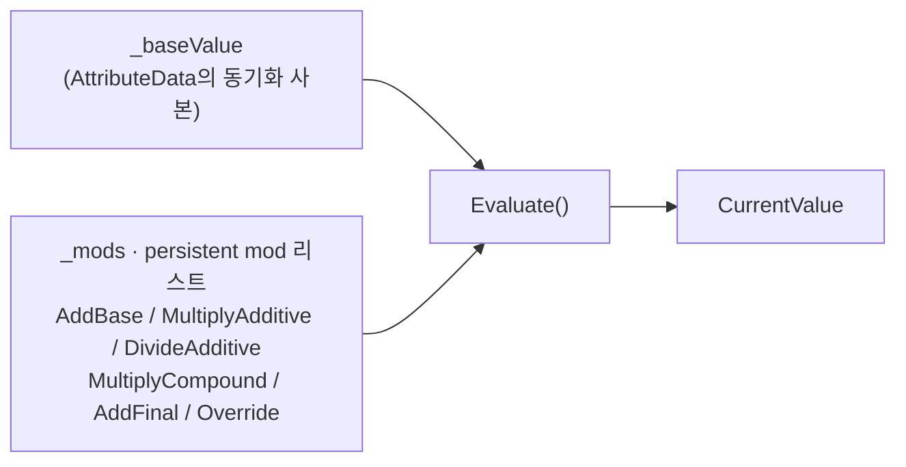
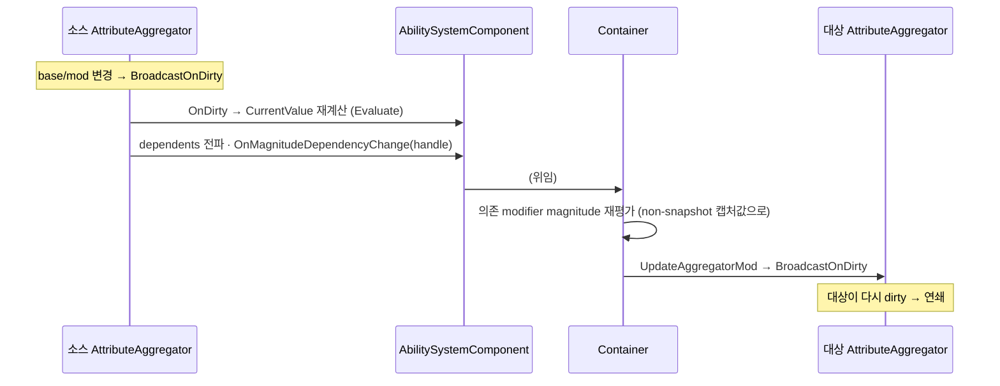

# AbilitySystem — Aggregator (어트리뷰트 반응성 / 라이브 재평가)

> **최종 갱신:** 2026-09-10 (KST)

어트리뷰트별 CurrentValue 집계와, 캡처 대상이 바뀌면 의존 이펙트를 **즉시 재평가**하는 반응성 계층. UE `FAggregator`의 집계 + dirty/dependents 개념을 재구현한다. 상위 개요는 [overview](overview.md).

> UE 대비는 [overview §UE GAS 대비](overview.md#ue-gas-대비--채택생략). **개념·방향** 중심. feature: [ability-system/aggregator](../../../agent/feature/ability-system/aggregator/progress.md).

## 무엇을 푸는가

두 가지를 한 객체가 맡는다.

1. **CurrentValue 집계** — 지속형 GE의 mod를 어트리뷰트별로 모아 공식으로 누산해 CurrentValue를 낸다. 값은 `Evaluate()` 한 경로로만 얻는다.
2. **라이브 재평가** — "방어력 = 힘의 10%"처럼 다른 어트리뷰트를 캡처한(non-snapshot) magnitude가, **소스 어트리뷰트가 바뀌면 그 즉시** 재계산돼 따라간다. 이게 없으면 magnitude가 apply 시점에 고정돼 non-snapshot이 무력해진다.

## 집계 (Evaluate)



`CurrentValue = ((Base + ΣAddBase) * MultiplyAdditive / DivideAdditive * ΠMultiplyCompound) + ΣAddFinal` (Override가 있으면 그 값이 최종을 덮어씀). 캐시가 아니라 매 조회 시 순수 계산이라, 값을 얻는 유일 경로가 `Evaluate()`다.

여기 담기는 mod는 **ASC에 등록된 지속형(persistent) 활성 GE의 modifier**다 — 컨테이너가 GE 적용/해제 시 등록·해제한다. Modifier의 정의·구조와 각 연산이 값에 무엇을 하는지는 → [gameplay-effect §Modifier](gameplay-effect.md#modifier).

## 소유 구도

- **어트리뷰트별 `AttributeAggregator`** — base 사본 + mod 리스트를 들고 `Evaluate()`로 CurrentValue를 산출한다.
- **`ActiveGameplayEffectsContainer`가 소유** — 어트리뷰트별로 하나씩 **지연 생성**(캡처나 지속 mod가 실제로 필요할 때만). 지속형 GE의 mod를 등록/해제한다.
- **base 진실은 `AttributeData`** — aggregator의 base는 동기화 사본이다. base 쓰기는 항상 `AttributeData`가 진실이고, aggregator가 있을 때만 함께 갱신한다. 모든 어트리뷰트에 aggregator를 강제로 만들지 않는 UE의 lazy 모델을 따른 것.

## 반응성 흐름 (라이브 재평가)

소스 어트리뷰트가 dirty해지면 두 갈래로 퍼진다 — ① 그 어트리뷰트의 CurrentValue 재계산, ② non-snapshot으로 이 값에 의존하는 GE들의 magnitude 재평가(연쇄).



- **의존 등록:** non-snapshot 캡처만 소스 aggregator에 "이 이펙트가 당신에게 의존한다"고 등록한다(`RegisterLinkedAggregatorCallbacks`). snapshot은 캡처 시점을 `TakeSnapshotOf`로 복사·고정해 등록하지 않는다. (캡처 구조·시점 상세 → [capture](capture.md))
- **연쇄와 순환:** 재평가가 다른 어트리뷰트를 dirty시키면 연쇄된다. 자기참조(A→B→A) 순환은 전파 깊이 상한(`MaxBroadcastDirty`)으로 끊는다 — 수렴 보장이 아니라 폭주 차단이다.

## 진입점 (Entry Points)

| 목적 | API | 위치 |
|---|---|---|
| CurrentValue 산출 | `AttributeAggregator.Evaluate()` | `Effect/AttributeAggregator.cs` |
| Base 직접 적용(영구) | `AttributeAggregator.ExecModOnBaseValue(base, op, mag)` (static) | 〃 |
| persistent mod 등록/해제 | `AddAggregatorMod` / `RemoveAggregatorMod` | 〃 |
| dirty 구독 | `OnDirty` (event) | 〃 |
| 의존자 등록/해제 | `AddDependent` / `RemoveDependent` | 〃 |
| snapshot 고정 | `AttributeAggregator.TakeSnapshotOf(other)` | 〃 |
| non-snapshot 링크 등록/해제 | `GameplayEffectAttributeCaptureSpecContainer.Register/UnregisterLinkedAggregatorCallbacks(handle)` | `Effect/GameplayEffectAttributeCaptureSpecContainer.cs` |

## UE ↔ Unity 대응

| UE GAS | 이 프로젝트 | 대응 시 판단 / 차이 |
|---|---|---|
| `FAggregator` | `AttributeAggregator` | 어트리뷰트별 집계 + dirty/dependents 재구현 |
| `FAggregator.ModChannels[]` · `FAggregatorModChannelContainer` | flat `List<Mod>` (채널·컨테이너 없음) | → 아래 "채널·컨테이너" |
| dirty broadcast / dependents | `OnDirty` event + `_dependents` | 채택. 순환은 깊이 상한으로 차단 |
| snapshot / non-snapshot 캡처 | `GameplayEffectAttributeCaptureSpec` (snapshot=`TakeSnapshotOf` / non=참조 보관) → [capture](capture.md) | 채택 |
| cross-actor 라이브 · fixed-point 수렴 | (생략) | 스코프 밖 — 아래 "범위" 참고 |

## UE 대비 — 채널·컨테이너

UE `FAggregator`는 mod를 평가 채널(`EGameplayModEvaluationChannel`, Channel0~15)별로 나눠 담고, 채널들을 래퍼로 감싼다:

```
FAggregator
 ├ BaseValue
 └ FAggregatorModChannelContainer
     └ FAggregatorModChannel[]          ← 채널별
         └ 연산별 mod 배열 (Add / Multiply / Divide / Override)
```

이 프로젝트는 **평가 채널을 Channel 0 하나로 고정**한다 — 채널 축과 컨테이너 래퍼를 두지 않고, `AttributeAggregator`가 mod를 **flat `List<Mod>`**로 직접 소유하고 `Evaluate()`가 조회 시 연산별로 집계한다. 채널·enum(`AggregatorModChannel`·`GameplayModEvaluationChannel`)은 두지 않는다.

## 범위 (UE 대비 생략)

- **대상:** 지속형(persistent) AttributeBased 모디파이어의 cross-attribute·self-effect 라이브 재평가. → 검증 완료.
- **생략(후속):** cross-actor 라이브(다른 액터 값 변화를 실시간 추종하는 cross-ASC 구독), 자기참조 fixed-point 수렴, Execution 라이브 재평가(Execution은 이벤트성이라 대상 아님), 태그 자격 판정(seam만).
