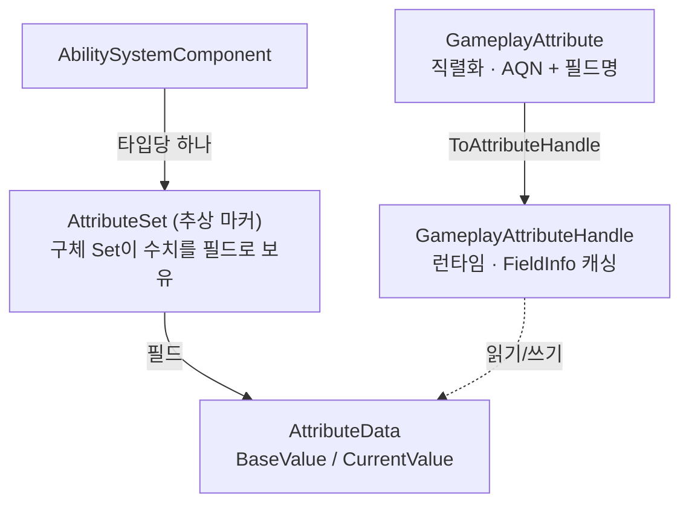
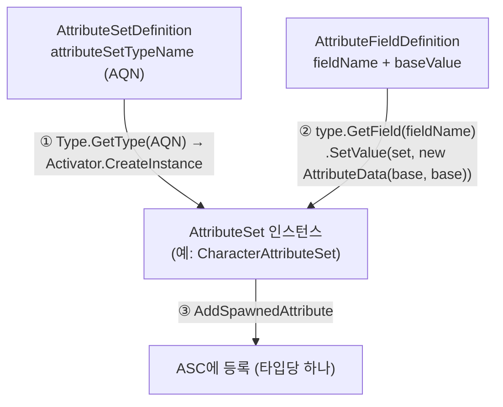
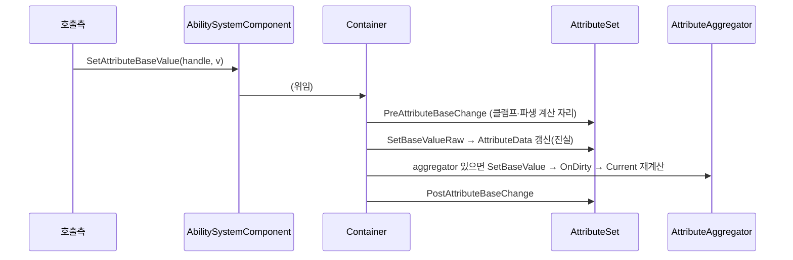

# AbilitySystem — Attribute

> **최종 갱신:** 2026-09-10 (KST)

캐릭터 수치(체력·스태미나·이동속도 등)를 담고 읽고/쓰는 계층. 상위 개요는 [overview](overview.md).

> UE GAS의 `UAttributeSet`/`FGameplayAttribute`를 참고해 필요한 축만 재구현. **개념·방향** 중심 — 필드·선언 세부는 코드를 본다.

## 구조



- **`AttributeSet`** — 빈 추상 마커. 구체 Set이 값을 필드로 보유하고, ASC는 타입당 하나만 등록한다(도메인별로 필요한 Set만 붙이고, 필드가 컴파일타임에 존재해 오타·타입 오류를 막는다).
- **`AttributeData`** — 한 수치의 `BaseValue`/`CurrentValue` 쌍. Base는 영구값, Current는 보정 반영값.

두 종류의 어트리뷰트 참조가 나온다 — 코드에서 쓰는 런타임 `GameplayAttributeHandle`과 에셋에 저장되는 직렬화 `GameplayAttribute`. 아래 작성 패턴이 전자를, 초기화가 후자를 쓴다.

## AttributeSet 만들기 — 작성 패턴

수치를 담을 구체 Set은 `AttributeSet`을 상속하고, 어트리뷰트마다 **두 가지를 짝지어** 선언한다 — 값을 담는 `AttributeData` 인스턴스 필드와, 그 필드를 밖에서 가리키는 `static readonly GameplayAttributeHandle`.

```csharp
public class CharacterAttributeSet : AttributeSet
{
    // (1) 실제 값 — 인스턴스 필드. ASC가 SO 초기값으로 채우고, 핸들이 읽고/쓴다.
    public AttributeData health;
    public AttributeData maxHealth;
    public AttributeData speed;

    // (2) 외부 식별용 정적 핸들 — 필드 하나당 하나. typeof + nameof로 필드에 묶는다.
    public static readonly GameplayAttributeHandle Health    = new(typeof(CharacterAttributeSet), nameof(health));
    public static readonly GameplayAttributeHandle MaxHealth = new(typeof(CharacterAttributeSet), nameof(maxHealth));
    public static readonly GameplayAttributeHandle Speed     = new(typeof(CharacterAttributeSet), nameof(speed));
}
```

- **값 필드(`AttributeData`)** — 실제 Base/Current를 든다. 캐릭터마다 값이 다르니 인스턴스에 있다.
- **정적 핸들(`GameplayAttributeHandle`)** — "이 Set의 이 어트리뷰트"를 코드에서 문자열 없이 가리키는 **이름표**. 값이 아니라 식별자라 타입당 하나면 충분해 `static readonly`. `typeof`+`nameof`로 Set·필드에 컴파일 타임에 묶어 오타·rename에 안전하다.

쓰는 쪽은 이 정적 핸들 하나로 값을 조회한다:

```csharp
float hp = asc.GetAttributeCurrentValue(CharacterAttributeSet.Health);
```

### UE의 매크로를 손으로 옮긴 것

UE GAS에선 어트리뷰트를 이렇게 선언한다:

```cpp
UPROPERTY() FGameplayAttributeData Health;    // 값
ATTRIBUTE_ACCESSORS(UMyAttributeSet, Health)  // 매크로가 접근자를 자동 생성
```

`ATTRIBUTE_ACCESSORS` 매크로가 `GetHealthAttribute()`(→ `FGameplayAttribute`) · `GetHealth()` · `SetHealth()` · `InitHealth()`를 **코드 생성**한다. 이 중 `GetHealthAttribute()`가 "밖에서 Health를 문자열 없이 가리키는 정적 진입점"이다.

C#엔 그런 코드 생성 매크로가 없다. 그래서 그 정적 접근자를 **손으로 하나 선언**한 게 `public static readonly GameplayAttributeHandle Health`다 — UE의 `GetHealthAttribute()`에 대응한다. `typeof`+`nameof` 바인딩으로 매크로가 주던 안전성(문자열 오타·rename 취약점 제거)을 매크로 없이 흉내 냈다.

> **대응 요약:** UE `FGameplayAttributeData Health`(값) + `GetHealthAttribute()`(정적 식별자) ↔ 여기 `AttributeData health`(값) + `static GameplayAttributeHandle Health`(정적 식별자).

## 참조 2분할 — 직렬화 vs 런타임

위 정적 핸들(`GameplayAttributeHandle`)은 **런타임 전용**이다 — `FieldInfo`를 들어 직렬화할 수 없다. 그래서 에셋·인스펙터가 어트리뷰트를 저장·저작하려면 문자열 형태의 짝이 하나 더 필요하고, 그게 `GameplayAttribute`다. (UE는 `FGameplayAttribute` 하나가 직렬화+런타임을 겸하지만, C#의 `FieldInfo` 직렬화 불가 제약상 둘로 나뉜다.)

- **`GameplayAttribute`(직렬화):** 타입명(AQN) + 필드명 문자열 쌍. 에셋 저작용 — GE modifier 대상, SO 초기값의 필드 지정 등.
- **`GameplayAttributeHandle`(런타임):** `GameplayAttribute.ToAttributeHandle()`로 문자열을 해석해 만든다. 값 동등성(`SetType`+`Name`)으로 Dictionary 키가 된다.

> **왜 FieldInfo 캐싱인가:** 핸들 생성 시 Reflection을 1회로 격리하면, 매 프레임 반복되는 값 읽기/쓰기(집계·재평가)에서 문자열 필드 탐색 비용이 사라진다. 비용을 "많이 호출되는 경로"에서 "한 번 만드는 경로"로 옮긴 선택이다.

## 초기화 (ScriptableObject)

초기값을 코드가 아니라 데이터로 준다 — 밸런싱을 코드 수정 없이 조정하기 위해. SO는 **"어느 Set의 · 어느 필드에 · 얼마"**를 문자열/숫자로만 담고, 런타임에 그걸 실제 `AttributeSet` 인스턴스로 조립한다.

**SO가 담는 것 (데이터 형태):**

```
AttributeDefinitionAsset (SO)
└ attributeSets: [
    AttributeSetDefinition
      ├ attributeSetTypeName : "Character.CharacterAttributeSet, Assembly-CSharp"   ← 어느 Set (AQN)
      └ attributes: [
          AttributeFieldDefinition { fieldName: "health",    baseValue: 100 }        ← 어느 필드에 · 얼마
          AttributeFieldDefinition { fieldName: "maxHealth", baseValue: 100 }
          AttributeFieldDefinition { fieldName: "speed",     baseValue:   5 }
        ]
  ]
```

**인스턴스로 조립 (`AbilitySystemComponent.AddSet`):**



1. `attributeSetTypeName`(AQN)을 `Type`으로 해석해 그 타입의 빈 인스턴스를 만든다.
2. 각 `AttributeFieldDefinition`의 `fieldName`으로 인스턴스의 필드를 찾아 `baseValue`를 넣는다 — `AttributeData(baseValue, baseValue)`라 **초기엔 Current = Base**.
3. 완성된 Set을 ASC에 등록한다(같은 타입이 이미 있으면 건너뜀).

> **핵심 연결고리:** SO의 `fieldName`은 Set 클래스의 `AttributeData` 필드 이름과 **정확히 같아야** 한다 — 작성 패턴의 `nameof(health)`가 가리키는 바로 그 이름이다. 안 맞으면 경고 후 그 필드만 건너뛴다. 이 경로는 필드에 직접 써서 `CurrentValue` 재계산(dirty)을 거치지 않아, 초기화 중 불필요한 재평가가 없다.

에디터 드로어가 이 배선을 도와, 인스펙터에서 타입/필드를 드롭다운으로 고르고 값만 채우면 된다.

## 값 접근

Base는 `AttributeData`가 진실이고, Current는 aggregator가 있으면 `Evaluate()`로만 산출된다(없으면 mod가 없어 base와 동일). 쓰기는 Base만 — Current는 집계 결과라 직접 쓰지 않는다.



`AttributeSet`은 소유 ASC를 알고(등록 시 주입), 값 변경 전후 훅(`PreAttributeBaseChange`/`PostAttributeBaseChange`)을 `virtual`로 열어 둔다 — 클램프·파생 수치 계산을 서브클래스가 얹는 자리다.

## UE ↔ Unity 대응

| UE GAS | 이 프로젝트 | 대응 시 판단 / Unity 제약 |
|---|---|---|
| `UAttributeSet` | `AttributeSet` (추상 마커) | 채택 |
| `FGameplayAttribute` (직렬화+런타임 겸용) | `GameplayAttribute`(직렬화) + `GameplayAttributeHandle`(런타임) | `FieldInfo` 직렬화 불가라 둘로 분리 |
| `ATTRIBUTE_ACCESSORS` 매크로 (`GetXAttribute()`) | `static readonly GameplayAttributeHandle` (손 선언) | 코드 생성 매크로가 없어 정적 식별자를 직접 선언 |
| `FGameplayAttributeData` | `AttributeData` (Base/Current) | 채택 |
| 초기값(DefaultStartingData 커브) | `AttributeDefinitionAsset` (SO) | 초기값을 데이터로. 커브는 미채택(고정값) |
| `PreAttributeChange` / `PostGameplayEffectExecute` 훅 | `Pre/PostAttributeBaseChange` (`virtual`) | 훅 자리 채택. 클램프 등 로직은 서브클래스 몫(일부 미탑재) |

## 진입점 (Entry Points)

| 목적 | API | 위치 |
|---|---|---|
| 직렬화 참조 → 런타임 핸들 | `GameplayAttribute.ToAttributeHandle()` | `Attribute/GameplayAttribute.cs` |
| 값 읽기 | `ASC.GetAttributeBaseValue(handle)` · `GetAttributeCurrentValue(handle)` | `AbilitySystemComponent.cs` |
| 값 쓰기(Base) | `ASC.SetAttributeBaseValue(handle, value)` | 〃 |
| 변경 훅 | `AttributeSet.Pre/PostAttributeBaseChange` (override) | `Attribute/AttributeSet.cs` |
| 초기값 정의 | `AttributeDefinitionAsset` (SO) → `ASC.AddSet()` | `Attribute/AttributeDefinitionAsset.cs` |

> Modifier 연산과 Base/Current가 어떻게 갈리는지는 [gameplay-effect](gameplay-effect.md), 집계·재평가는 [aggregator](aggregator.md) 참조.
