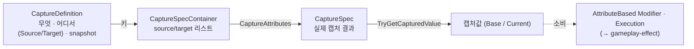
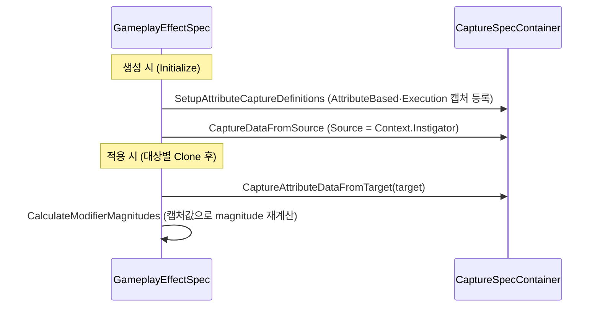

# AbilitySystem — Attribute Capture

> **최종 갱신:** 2026-09-10 (KST)

한 GE의 계산이 **다른 어트리뷰트 값을 끌어와 쓰는** 메커니즘 — 값을 **가져오기까지**만 담당한다(가져온 값으로 magnitude를 계산하는 건 소비처 몫). "방어력 = 힘의 10%", "받는 피해 = 공격자 공격력 − 내 방어력" 같은 cross-attribute 계산의 토대다. 상위 개요 [overview](overview.md) · 라이브 재평가 [aggregator](aggregator.md).

> **소비처는 gameplay-effect에 있다** — [AttributeBased Modifier](gameplay-effect.md#modifier)(캡처값 → magnitude 식)와 [Execution](gameplay-effect.md#execution--복합-계산-훅)(`Defs`로 선언·조회). 캡처는 그들에게 값을 넘길 뿐 계산식을 갖지 않는다.
> UE `FGameplayEffectAttributeCaptureSpec`의 캡처 개념을 축소 재현. **개념·방향** 중심.

## 구성 요소

- **`GameplayEffectAttributeCaptureDefinition`** — "무엇을(`GameplayAttribute`)·어디서(`AttributeCaptureSource`)·snapshot 여부"를 담는 불변 식별자. **값은 없다.** 캡처 컨테이너에서 "같은 대상을 두 번 캡처하지 않게" 하는 키라 값 동등성을 정의한다.
- **`GameplayEffectAttributeCaptureSpec`** — 정의 하나에 대한 **실제 캡처 결과**. snapshot이면 캡처 시점 aggregator를 복사해 고정, non-snapshot이면 컨테이너 소유 aggregator를 참조로 든다.
- **`GameplayEffectAttributeCaptureSpecContainer`** — 한 Spec이 캡처하는 것들을 source/target 리스트로 보관·조회. 적용 시 대상별 `Clone()`로 target 캡처가 섞이지 않게 한다.

## 캡처 시점 — Source vs Target

Source는 발동 주체(`Context.Instigator`)라 **Spec 생성 시** 캡처되고, Target은 받는 대상이라 **적용 시** 캡처된다. 적용 경계에서 spec을 대상별로 복제한 뒤 target을 캡처하므로, 같은 정의를 여러 대상에 적용해도 캡처값이 섞이지 않는다.

## snapshot vs non-snapshot

| | 캡처 방식 | 조회 시 | 소스 어트리뷰트가 바뀌면 | 예 |
|---|---|---|---|---|
| **snapshot = true** | `TakeSnapshotOf`로 값 복사·고정 | 고정값 | 무반응 | 시전 순간의 공격력 |
| **snapshot = false** | 컨테이너 소유 aggregator를 참조로 보관 | 라이브 `Evaluate()` | dependent로 등록돼 magnitude 재평가(연쇄) | 매 틱 현재 방어력 |

non-snapshot만 소스 aggregator에 "이 GE가 당신에게 의존한다"고 등록한다(`RegisterLinkedAggregatorCallbacks`) — 이 링크가 라이브 재평가의 트리거다. 연쇄·순환 처리는 [aggregator](aggregator.md).

## 값 종류 — Base vs Current

`AttributeCaptureValueType`로 무엇을 읽을지 정한다 — `BaseValue`(영구값) 또는 `CurrentValue`(보정 반영값). 캡처 정의는 "무엇을 캡처하나"만 고정하고, "Base/Current 중 무엇으로 소비하나"는 조회 시점에 지정한다.

## 진입점 (Entry Points)

| 목적 | API | 위치 |
|---|---|---|
| 캡처 대상 정의 | `GameplayEffectAttributeCaptureDefinition` | `Effect/GameplayEffectAttributeCaptureDefinition.cs` |
| 캡처 수행 | `Container.CaptureAttributes(asc, source)` | `Effect/GameplayEffectAttributeCaptureSpecContainer.cs` |
| 캡처값 조회 | `CaptureSpec.TryGetCapturedValue(valueType, out value)` | `Effect/GameplayEffectAttributeCaptureSpec.cs` |
| non-snapshot 링크 등록/해제 | `Container.Register/UnregisterLinkedAggregatorCallbacks(handle)` | `Effect/GameplayEffectAttributeCaptureSpecContainer.cs` |

## UE ↔ Unity 대응

| UE GAS | 이 프로젝트 | 대응 시 판단 / 차이 |
|---|---|---|
| `FGameplayEffectAttributeCaptureDefinition` | `GameplayEffectAttributeCaptureDefinition` | 채택. 대상 어트리뷰트는 직렬화 가능한 `GameplayAttribute`로 |
| `FGameplayEffectAttributeCaptureSpec` | `GameplayEffectAttributeCaptureSpec` | 채택 |
| snapshot / non-snapshot | 동일 개념 | 채택 |
| `FGameplayEffectContext`의 Source/Target | `AttributeCaptureSource` (Source/Target) | 채택 |
