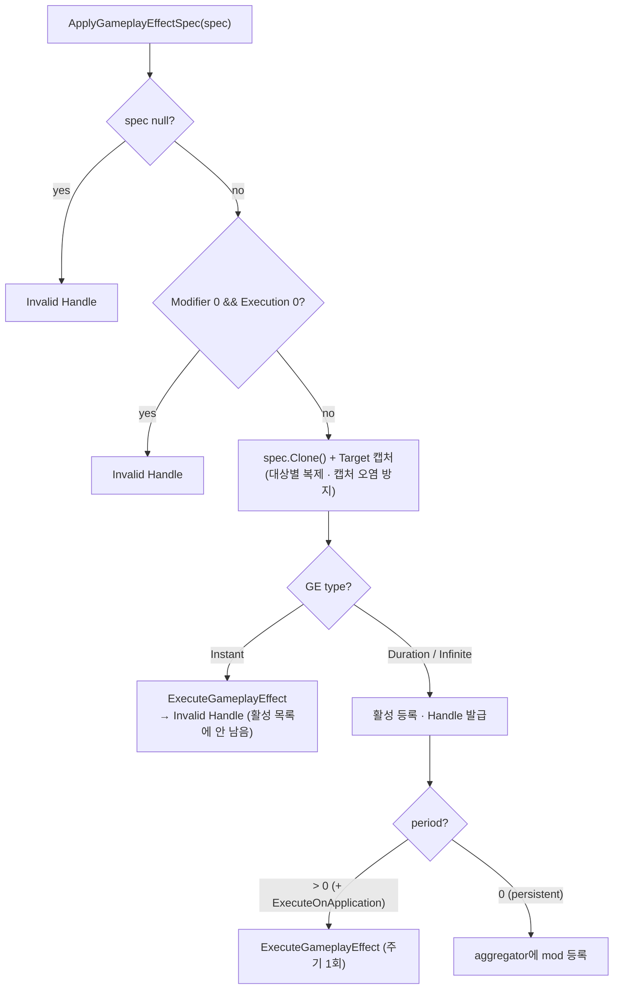
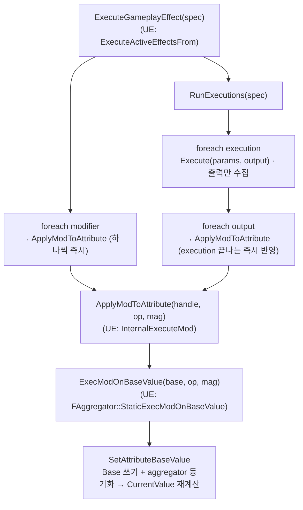

# AbilitySystem — GameplayEffect

> **최종 갱신:** 2026-09-10 (KST)

수치 변경을 통과시키는 단일 채널. 상위 개요는 [overview](overview.md), 대상 수치는 [attribute](attribute.md), 라이브 재평가는 [aggregator](aggregator.md).

> UE GAS의 GameplayEffect를 참고해 **필요한 축만 직접 구현** — UE 대비 채택/생략은 [overview §UE GAS 대비](overview.md#ue-gas-대비--채택생략).
> 이 문서는 **개념·방향** 중심이다. 필드·에셋 작성 절차 등 세부는 코드와 각 feature progress를 본다.

## 정의 ↔ 런타임 (Asset ↔ Spec)

- **`GameplayEffectAsset`(SO):** "무엇을·얼마나·어떻게" 바꿀지의 **불변 정의** — 타입, 지속/주기, Modifier 목록, Execution 목록.
- **`GameplayEffectSpec`(런타임):** 적용 시 Asset으로부터 만들어지는 인스턴스. 적용 경계에서 **대상별로 복제(Clone)**돼 대상 캡처값이 서로 섞이지 않는다.
- **`ActiveGameplayEffect`:** 지속형 GE의 활성 상태(남은 시간·주기 타이머)를 들고 컨테이너에 등록. 핸들로 식별·해제.

**왜 나누나:** 하나의 Asset을 여러 대상·인스턴스가 공유하므로, 런타임 가변 상태(캡처값·타이머)는 Spec 쪽에 둬야 서로 간섭하지 않는다. Execution도 같은 이유로 '데이터(SO)'가 아니라 '로직(순수 클래스)'이며 무상태다.

## Modifier

한 Modifier는 **어트리뷰트 하나를 어떻게 바꿀지**의 최소 단위다 — 대상 어트리뷰트 + 연산 + magnitude. GE(Asset)는 Modifier 목록을 든다.

### 정의 ↔ 런타임 슬롯

| | 타입 | 담는 것 |
|---|---|---|
| 정의 | `GameplayModifier` (`struct`, Asset의 `Modifiers`) | 대상 `GameplayAttribute` · `operation` · magnitude 계산방식 |
| 런타임 | `GameplayModifierSpec` (`struct` 슬롯) | 평가된 `EvaluatedMagnitude` 하나 |

둘은 **같은 인덱스로 평행한 배열**이다(`Modifiers[i]` ↔ `Definition.Modifiers[i]`). identity(대상·연산)는 불변 정의가 들고, 대상·캡처마다 달라지는 **계산된 수치**만 런타임 슬롯이 든다 — 그래서 하나의 Asset을 여러 대상이 공유해도 평가값이 섞이지 않는다.

### magnitude 계산 (`MagnitudeCalculationType`)

- **`ScalableFloat`** — 고정 float(추후 Level 커브 테이블).
- **`AttributeBased`** (`AttributeBasedMagnitude`) — 캡처한 어트리뷰트 값에서 magnitude를 유도한다:

  ```
  magnitude = (capturedValue + PreMultiplyAdditive) * Coefficient + PostMultiplyAdditive
  ```

  `Coefficient` 기본값은 1이다(0이면 캡처값이 통째로 사라진다) — 이 기본값을 살리려 `AttributeBasedMagnitude`를 `struct`가 아닌 **`class`로 둔다**(Unity는 struct 필드 초기화값을 새 인스턴스에 반영 못 함). 조회 실패 시 0으로 계산하되 경고를 남긴다. 값을 **어디서·어떻게 가져오는지**(Source/Target·snapshot·Base/Current)는 → [capture](capture.md).

magnitude는 **Spec 생성 시(Source 캡처 후)와 적용 시(Target 캡처 후)** `CalculateModifierMagnitudes`가 각 슬롯에 채운다 — AttributeBased가 캡처값에 의존하기 때문. 적용 시점엔 값이 이미 확정돼, 이후 순차 적용으로 바뀌는 건 *무엇에 더하는가*지 *얼마*가 아니다.

### 연산 (`GameplayModifierOperation` 6종)

| 연산 | 값에 하는 것 |
|---|---|
| `AddBase` | 곱셈 전 합 |
| `MultiplyAdditive` | 배율 누산 `1 + Σ(m−1)` (1.5x + 1.5x = 2.0x) |
| `DivideAdditive` | 제수 누산 (분모에 동일 방식) |
| `MultiplyCompound` | 배율 곱산 `Π m` (1.5x · 1.5x = 2.25x) |
| `AddFinal` | 곱셈 후 합 |
| `Override` | 최종값 대체 |

여러 Modifier가 이 연산들로 **어떻게 하나의 CurrentValue로 합쳐지는지**(누산·곱산 공식)는 지속형 GE의 mod를 집계하는 aggregator가 소유한다 → [aggregator](aggregator.md). Execution이 직접 뱉는 평가 결과도 `GameplayModifierEvaluatedData`(대상·연산·수치) 형태로 같은 적용 경로를 탄다.

## 값 변경의 두 경로 — BaseValue vs CurrentValue

GAS의 핵심 구분. 성격이 다른 두 종류의 수치 변경을 갈라 다룬다.

- **영구 변경(BaseValue):** 데미지·힐 같은 소모. Base에 직접 적용돼 남는다.
- **일시 보정(CurrentValue):** 장비·버프 같은 지속 효과. Base는 두고 활성 mod를 모아 CurrentValue를 산출 → 해제하면 정확히 원복.

갈림의 축은 **타입이 아니라 `period`** 다 — 주기 실행은 매 틱이 작은 영구 변경이라 영구 경로에 묶인다.

| 타입 | `period` | 무엇이 바뀌나 | 해제 시 |
|---|---|---|---|
| Instant | — | BaseValue (영구) | 활성 목록에 없음 |
| Duration / Infinite | `> 0` | BaseValue (틱마다 영구) | 반영된 값은 남음 |
| Duration / Infinite | `0` | CurrentValue만 | 자동/수동 원복 |

적용은 타입과 `period`로 경로를 가른다:



### CurrentValue 집계

persistent(period 0) mod는 대상 어트리뷰트별 **Aggregator**에 등록되고, CurrentValue는 읽을 때 연산별로 누산·곱산돼 나온다. 연산이 종류별로 모여 한 번에 공식에 들어가므로 **modifier 순서가 결과에 영향을 주지 않는다**(Override 제외) — 반대로 영구 경로(아래 Execute)는 Base에 순차 적용이라 순서가 영향을 준다. 결합 공식(`((Base+ΣAddBase)*…)+ΣAddFinal`)·라이브 재평가 상세는 → [aggregator](aggregator.md).

### CurrentValue가 다시 계산되는 시점

CurrentValue는 캐시가 아니라 base·mod로부터 `Evaluate`로 파생된다. 다음에서 재계산(aggregator dirty)이 돈다:

| 시점 | 계기 |
|---|---|
| Base 직접 변경 | `SetAttributeBaseValue` |
| Execute 경로가 Base를 바꿀 때 | Instant/주기형 modifier·Execution 출력 |
| persistent mod 등록/해제 | 지속형 GE 적용 · 해제 · 만료 |
| 캡처 소스 변경 | non-snapshot 의존 이펙트 라이브 재평가 → [aggregator](aggregator.md) |

초기화(Awake)는 base·current를 직접 세팅한다(dirty 없음). dirty 전파·연쇄 상세는 [aggregator](aggregator.md).

## Execute 경로 (영구 변경)

Instant/주기형이 타는 경로. Modifier와 Execution 출력을 BaseValue에 적용한다.



**설계 포인트 — 쓰기 경로 단일화:** Modifier와 Execution 출력이 같은 함수(`ApplyModToAttribute`)로 적용된다 — 경로별 지원 연산이 어긋나지 않고, 클램프·사망 판정 훅 자리도 한 곳으로 모인다. (magnitude는 Spec 시점에 확정 → [Modifier](#modifier), Execution 출력은 단위별 즉시 반영 → [Execution](#execution--복합-계산-훅).)

## 수명 (Tick)

주기형은 타이머로 매 주기 실행하고(프레임 지연 시 누락 틱을 몰아 소화), Duration은 남은 시간을 차감해 만료 시 해제한다. Infinite는 수동 해제까지 유지된다.

## Execution — 복합 계산 훅

단순 Modifier로 표현하기 어려운 계산(분기·클램프·다중 어트리뷰트, 예: `받는 피해 = Source 공격력 − Target 방어력`)을 담는 **추상 클래스**. 데이터(SO)가 아니라 무상태 로직이라 Asset은 타입 이름(AQN)만 저장하고 Spec 생성 시 인스턴스화한다. **Instant/주기형에서만 실행** — 지속형(period 0)의 상시 계산은 [Modifier](#modifier)의 AttributeBased가 맡는다.

### 구조 — 입력/출력 분리

- **`abstract Execute(parameters, output)`** — 계산 본체. **출력에만 쓰고 어트리뷰트를 직접 건드리지 않는다.**
- **`virtual Defs()`** — 이 Execution이 캡처할 어트리뷰트 정의(기본 빈 목록, 보통 `static` 배열). Spec이 읽어 캡처 컨테이너에 등록한다 → [capture](capture.md).
- **`GameplayEffectExecutionParameters`** (입력, readonly struct) — `TargetAsc` · `SourceAsc`(= Context.Instigator) · `Spec`. `AttemptCalculateCapturedAttributeMagnitude`(Current) / `...BaseValue`(Base)로 캡처값을 조회한다.
- **`GameplayEffectExecutionOutput`** (출력, readonly struct) — `AddOutputModifier(handle, magnitude, operation)`로 결과를 쌓는다. 반드시 `Create()`로 만들어야 내부 버퍼가 있다(아니면 출력 무시 + 경고).

입력과 출력을 한 객체에 안 섞는 게 설계 포인트다 — Execution은 "읽고(params) → 계산 → 뱉기(output)"만 하고, 실제 어트리뷰트 반영은 ASC/컨테이너가 한다. 출력은 `GameplayModifierEvaluatedData`(대상·연산·수치)라 일반 Modifier와 같은 적용 경로를 탄다.

### 작성 예시 (형태)

```csharp
public sealed class DamageExecution : GameplayEffectExecution
{
    // 캡처 선언 — 보통 static. (Source 공격력, Target 방어력 등)
    static readonly GameplayEffectAttributeCaptureDefinition[] _defs = { /* ... */ };
    public override ReadOnlySpan<GameplayEffectAttributeCaptureDefinition> Defs() => _defs;

    public override void Execute(GameplayEffectExecutionParameters p, GameplayEffectExecutionOutput output)
    {
        p.AttemptCalculateCapturedAttributeMagnitude(/* 공격력 def */, out float atk);
        p.AttemptCalculateCapturedAttributeMagnitude(/* 방어력 def */, out float def);

        float damage = Mathf.Max(0f, atk - def);
        output.AddOutputModifier(CharacterAttributeSet.Health, -damage, GameplayModifierOperation.AddBase);
    }
}
```

> 캡처 조회는 실패 시 `false`+`0`으로 **조용히** 흐른다 — 호출측이 반환 bool을 확인하지 않으면 0이 계산에 샌다.

실행은 위 [Execute 경로](#execute-경로-영구-변경)의 `RunExecutions`가 담당한다 — Execution마다 새 params/output을 만들어 부르고, 출력을 **그 Execution이 끝나는 즉시** BaseValue에 반영하므로 뒤 Execution이 앞 결과를 본다.

## 캡처 (Attribute Capture)

GE의 계산이 **다른 어트리뷰트 값을 끌어와** 쓰는 장치. GE 안에서 캡처를 소비하는 곳은 둘이다:

- **[AttributeBased Modifier](#modifier)** — magnitude를 캡처값에서 유도(`(v+Pre)*Coeff+Post`). 예: "방어력 = 힘의 10%".
- **[Execution](#execution--복합-계산-훅)** — `Defs()`로 캡처를 선언하고 `Execute`에서 조회해 복합 계산. 예: "받는 피해 = Source 공격력 − Target 방어력".

GE 관점에선 두 축만 잡으면 된다:

- **어디서(`AttributeCaptureSource`):** `Source`(발동 주체 = Context.Instigator, **Spec 생성 시** 캡처) vs `Target`(받는 대상, **적용 시** 캡처). 적용 경계의 대상별 `Clone`이 Target 캡처를 섞이지 않게 한다.
- **언제까지(`snapshot`):** `snapshot`은 캡처 시점 값으로 **고정**, non-snapshot은 원본 어트리뷰트가 바뀌면 **추종**한다(라이브 재평가 → [aggregator](aggregator.md)).

캡처 구조(`CaptureDefinition` / `CaptureSpec` / `Container`)·계산식·진입점 전체는 → **[capture](capture.md)**.

## 진입점 (Entry Points)

| 목적 | API | 위치 |
|---|---|---|
| 컨텍스트·Spec 생성 | `MakeEffectContext()` · `MakeOutgoingSpec(effect, ctx, level)` | `AbilitySystemComponent.cs` |
| GE 적용(자신/대상) | `ApplyGameplayEffectToSelf` · `ApplyGameplayEffectToTarget` | 〃 |
| 지속형 GE 해제 | `RemoveActiveGameplayEffect(handle)` | 〃 |

`SpecHandle`은 **의도적 생략** — Spec이 이미 class라 래퍼 이득이 없다. 실제 소유·수명·집계는 ASC가 아니라 `ActiveGameplayEffectsContainer`가 맡고 ASC는 얇은 위임 래퍼다.

## UE ↔ Unity 대응

UE GAS의 타입을 이 프로젝트에 어떻게 옮겼는지, Unity/C# 제약에서 온 차이는 무엇인지.

| UE GAS | 이 프로젝트 | 대응 시 판단 / Unity 제약 |
|---|---|---|
| `UGameplayEffect` (정의) | `GameplayEffectAsset` (ScriptableObject) | 정의를 데이터 에셋으로. 런타임 타입과 구분하려 **`Asset` 접미어** |
| `FGameplayEffectSpec` | `GameplayEffectSpec` (class) | 정의/런타임 인스턴스 분리 그대로 채택 |
| `FActiveGameplayEffect` | `ActiveGameplayEffect` | 활성 상태(타이머·남은 시간) |
| `FGameplayModifierInfo` | `GameplayModifier` (`struct`, `[Serializable]`) | 연산 6종으로 축소. **struct 슬롯 배열**로 둬 라이브 재평가 시 magnitude 제자리 갱신 |
| `FGameplayEffectExecutionCalculation` (UObject) | `GameplayEffectExecution` (순수 무상태 클래스) | SO가 임의 클래스를 못 담아 **AQN 문자열로 저장**하고 Spec 생성 시 인스턴스화 |
| Modifier magnitude (ScalableFloat curve / AttributeBased / SetByCaller / Custom) | `ScalableFloat`(현재 고정 float) · `AttributeBased` | Curve·SetByCaller·Custom은 미채택/예정 |
| 캡처(`FGameplayEffectAttributeCaptureSpec`) | `GameplayEffectAttributeCaptureSpec`(+Container) | snapshot/non-snapshot 캡처 채택 |
| `FGameplayEffectSpecHandle` | (생략) | Spec이 이미 class라 핸들 래퍼 이득 없음 |

> 원칙은 [overview](overview.md)의 "UE GAS의 선택적 이식" — 개념·방향을 따르되, UE 고유 제약(UObject·네트워크)에서 온 구현은 그 제약이 없으면 Unity 관용에 맞춰 다시 정한다.

## 미구현 / 알려진 한계

| 항목 | 내용 |
|---|---|
| AttributeSet 클램프 훅 | 값 범위 강제(체력이 max 초과·음수)가 없다 — Pre/Post 훅 자리는 있으나 로직 미탑재 |
| GE 스택 | 같은 GE 중복 적용 시 스택 수·Overflow 정책 |
| Gameplay Cue | GE 적용/해제 시 VFX·SFX 트리거 |
| GameplayTag | 태그 기반 자격·면역·조건 |
| ScalableFloat 커브 | Magnitude를 Level 기반 커브로 (현재 고정 float) |
| Magnitude 확장 | `SetByCaller`(도입 예정) · `CustomCalculationClass` |
