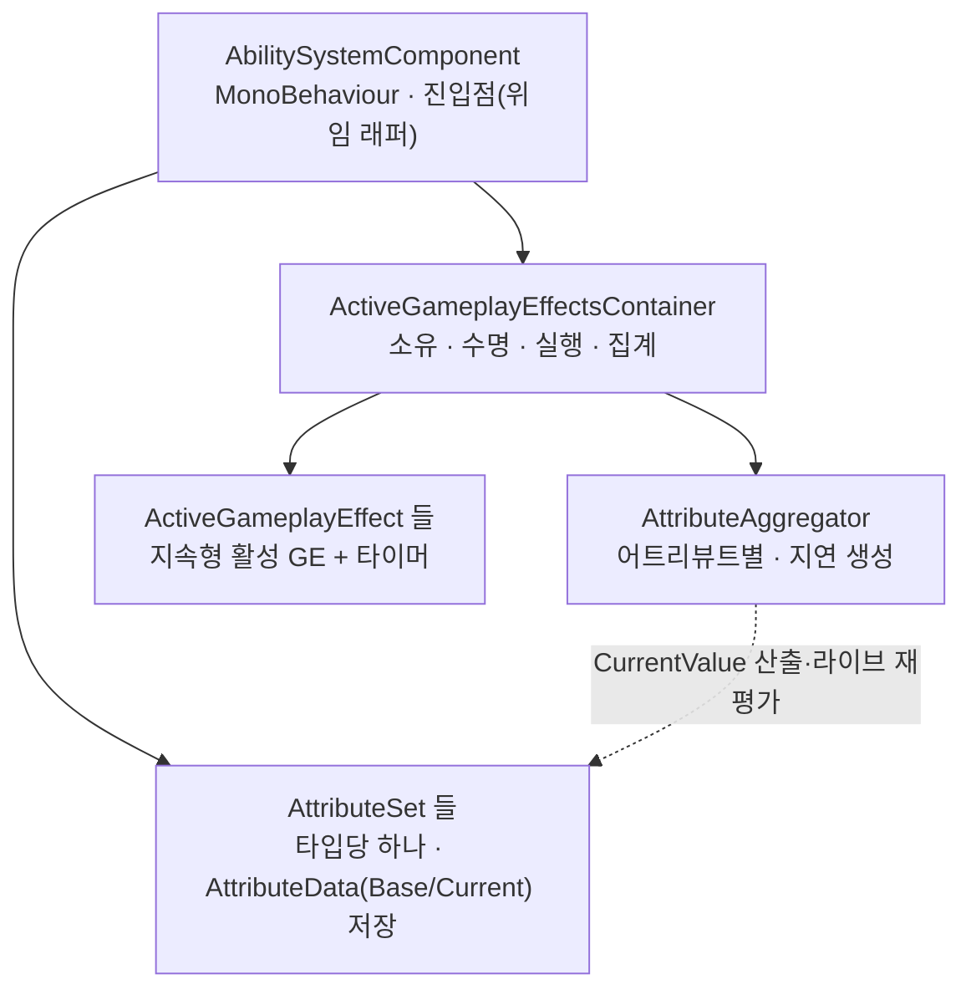
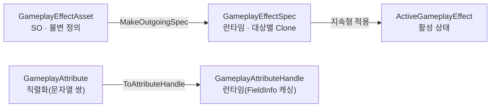
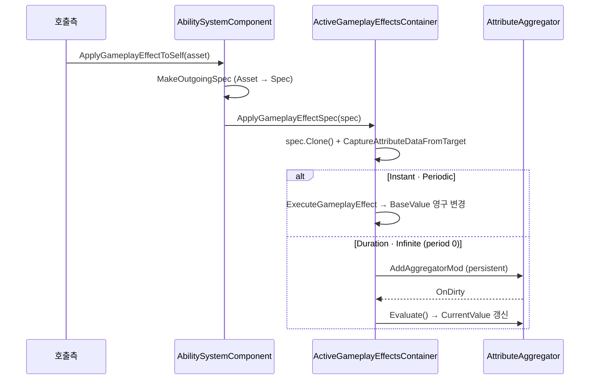

# AbilitySystem (GAS-like) — Overview

> **최종 갱신:** 2026-09-10 (KST)

`Assets/Scripts/Core/AbilitySystem/` — 캐릭터 수치 관리를 위한 경량 Ability System. **UE5 GAS를 참고해 필요한 축만 골라 Unity에 직접 재구현**한 것이다 — 라이브러리 이식이 아니라 개념의 선택적 재구현. 채택/생략은 아래 [UE GAS 대비](#ue-gas-대비--채택생략) 참고.

> **심화 문서:** [Attribute](attribute.md) · [GameplayEffect](gameplay-effect.md) · [Aggregator (라이브 재평가)](aggregator.md) · [Capture (어트리뷰트 캡처)](capture.md) · [GameplayAbility (계획)](gameplay-ability.md)
> 이 문서군은 **개념·방향** 중심이다. 필드·API 세부는 코드와 feature progress를 본다.
> 네이밍: 클래스명은 UE 용어를 따르되, SO(에셋 정의)에는 `Asset` 접미어로 런타임 타입과 구분한다.

## 핵심 구조

소유 관계 — `AbilitySystemComponent`는 진입점이고 실제 소유·수명·집계는 컨테이너가 맡는다.



정의 → 런타임 — 불변 SO 정의에서 대상별 런타임 인스턴스를 만든다.



- **ASC:** 수치·이펙트의 진입점. 실제 소유·수명·집계는 컨테이너에 위임하는 얇은 래퍼.
- **수치·이펙트·집계:** 각각 [attribute](attribute.md) · [gameplay-effect](gameplay-effect.md) · [aggregator](aggregator.md)에서 상세.

## 적용 흐름

GE를 적용하면 정의(SO)가 대상별 Spec으로 복제되고, GE 타입에 따라 두 경로로 갈린다 — Instant/Periodic은 BaseValue를 **영구 변경**, Duration/Infinite(period 0)는 aggregator에 mod로 등록돼 **CurrentValue에만** 반영된다.



캡처 대상이 바뀌면 aggregator가 dirty를 전파해 의존 GE의 magnitude가 라이브 재평가된다 → [aggregator](aggregator.md).

## 사용 예 (End-to-End)

각 시스템의 상세 API·진입점은 하위 문서를 본다 — [attribute](attribute.md) · [gameplay-effect](gameplay-effect.md) · [aggregator](aggregator.md) · [capture](capture.md).

```csharp
// 인스펙터에서 정의 에셋(SO)을 물려 둔다.
[SerializeField] private GameplayEffectAsset poisonEffect;

// 적용 — Instant면 즉시 BaseValue 변경(Invalid Handle), Duration/Infinite면 핸들 반환.
ActiveGameplayEffectHandle handle = asc.ApplyGameplayEffectToSelf(poisonEffect);

// 조회 — 정적 핸들로 CurrentValue를 바로 읽는다.
float hp = asc.GetAttributeCurrentValue(CharacterAttributeSet.Health);

// 제거 (지속형)
asc.RemoveActiveGameplayEffect(handle);
```

## UE GAS 대비 — 채택/생략

> 범례: ✅ 구현·동작 · 🔜 계획(로드맵) · ❌ 미채택

| UE GAS | 이 프로젝트 | 상태 | 판단 |
|---|---|---|---|
| `UAbilitySystemComponent` | `AbilitySystemComponent` (+ 컨테이너) | ✅ | 수치·이펙트 허브. 핵심이라 채택 |
| `UAttributeSet` / `FGameplayAttribute` | `AttributeSet` / `GameplayAttribute`·`GameplayAttributeHandle` | ✅ | UE 단일 `FGameplayAttribute`를 C# 제약(FieldInfo 직렬화 불가)상 직렬화용+런타임용 둘로 분리 → [attribute](attribute.md) |
| `FGameplayEffectSpec` / `FActiveGameplayEffect` | `GameplayEffectSpec` / `ActiveGameplayEffect` | ✅ | 정의(SO)/런타임 인스턴스 분리 채택 → [gameplay-effect](gameplay-effect.md) |
| `FGameplayModifierInfo` | `GameplayModifier` (연산 6종) | ✅ | 연산 6종으로 축소 → [gameplay-effect](gameplay-effect.md#modifier) |
| `FAggregator` (dirty/dependents) | `AttributeAggregator` | ✅ | 어트리뷰트별 집계 + 라이브 재평가 → [aggregator](aggregator.md) |
| `FGameplayEffectContext` | `GameplayEffectContext`(+Handle) | ✅ | 출처·타깃 채택 |
| `FGameplayEffectExecutionCalculation` | `GameplayEffectExecution` | ✅ | 복합 계산 훅. 프레임워크·검증 완료, 실전 전투 공식은 미확정 → [gameplay-effect](gameplay-effect.md) |
| AttributeBased Magnitude / 캡처 | `AttributeBasedMagnitude` · `GameplayEffectAttributeCaptureSpec` | ✅ | 캡처 기반 magnitude(snapshot/live) → [capture](capture.md) |
| `UGameplayAbility` | (계획) | 🔜 | 실행 계층 — 수치 계층 뒤로 → [gameplay-ability](gameplay-ability.md) |
| `SetByCaller` / `ScalableFloat`(Curve) | (계획) | 🔜 | Magnitude 확장 |
| `GameplayTag` / `GameplayCue` / GE Stack | (계획) | 🔜 | 태그·연출·스택 — 로드맵 |
| Prediction / Replication (네트워크) | (미채택) | ❌ | 네트워크 레이어가 없어 레플리케이션 설계 자체가 성립하지 않음 (로컬 전용) |

---

- 프로젝트 아키텍처 인덱스: [../overview.md](../overview.md)
- feature 추적: [feature/ability-system](../../../agent/feature/feature-list.md)
